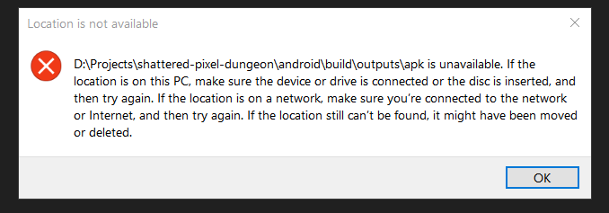

# Active Context

## Platform Detection Log - [2024-06-03]
- Detected OS: Windows
- Path Separator Style: \
- Confidence: High

## Project Information
- Project Name: Shattered Pixel Dungeon
- Type: LibGDX-based Android/Desktop Game
- Current Focus: Game Analysis for Productivity Integration
- Current Version: 3.1.0 (Version Code: 846)

## Task Status
- Current Task: Analyze game architecture and mechanics for productivity features
- Status: In progress - Documentation and code exploration
- Last Action: Identified key game systems for analysis
- Previous Action: Successfully tested game on Android device

## Build Information
- Android Build Status: Successful (3.1.0-INDEV)
- Desktop Build Status: Not tested (not needed at this time)
- Installation Method: Manual transfer to device (ADB install had issues)
- Verification: APK installed and launched successfully

## Project Goals
- Primary Goal: Understand game architecture for productivity integration
- Secondary Goal: Create debug tools to observe game behavior
- Long-term Vision: Integrate productivity features using game mechanics
- Conceptual Direction: Transform task management into an RPG experience

## Code Assessment
- Core Game Logic: Dungeon.java (manages game state, levels, and progression)
- Game Settings: SPDSettings.java (handles config, preferences, and options)
- Application Entry: ShatteredPixelDungeon.java (manages application lifecycle)
- Structure: Standard Java architecture with organized packages
- Design Pattern: Appears to follow MVC pattern with clear separation of concerns

## Next Steps
1. Create detailed documentation of core game systems
2. Identify potential integration points for productivity features
3. Explore options for enabling debug logging/visualization
4. Develop conceptual model for game-productivity integration

## VAN Process Status - [2025-06-06]
- Verified Memory Bank directory structure
- Verified existing files in Memory Bank
- Core Repository verified: Shattered Pixel Dungeon (LibGDX-based roguelike game)
- Android SDK configured successfully in local.properties
- Android debug APK successfully built with current version (3.1.0-INDEV)
- Current Task Complexity updated to Level 3 (Code Understanding for Gamification)
- Project focus shifted to game analysis and productivity integration
- Initial code exploration completed for key game files 